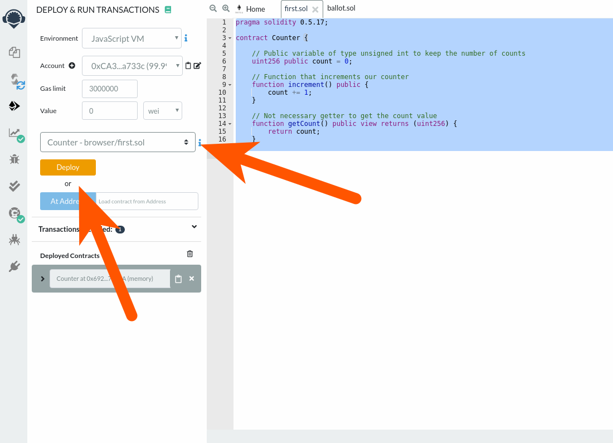

I guess you are as excited as us to [deploy](/developers/docs/smart-contracts/deploying/) and interact with your first [smart contract](/developers/docs/smart-contracts/) on the Ethereum blockchain.

Don’t worry, as it’s our first smart contract, we’ll deploy it on a [local test network](/developers/docs/networks/) so it does not cost anything for you to deploy and play as much as you’d like with it.

## Writing our contract {#writing-our-contract}

First step is to [visit Remix](https://remix.ethereum.org/) and create a new file. On the upper left part of the Remix interface add a new file and enter the file name you want.


In the new file, we’ll paste the following code.

```solidity
// SPDX-License-Identifier: MIT
pragma solidity >=0.5.17;

contract Counter {

    // Public variable of type unsigned int to keep the number of counts
    uint256 public count = 0;

    // Function that increments our counter
    function increment() public {
        count += 1;
    }

    // Not necessary getter to get the count value
    function getCount() public view returns (uint256) {
        return count;
    }

}
```

If you’re used to programming you can easily guess what this program does. Here is an explainer line by line:

- Line 4: We define a contract with the name `Counter`.
- Line 7: Our contract stores one unsigned integer named `count` starting at 0.
- Line 10: The first function will modify the state of the contract and `increment()` our variable `count`.
- Line 15: The second function is just a getter to be able to read the value of the `count` variable outside of the smart contract. Note that, as we defined our `count` variable as public this is not necessary but is shown as an example.

This is all for our first simple smart contract. As you may know, it looks like a class from OOP (Object-Oriented Programming) languages like Java or C++. It’s now time to play with our contract.

## Deploying our contract {#deploying-our-contract}

As we wrote our very first smart contract, we’ll now deploy it to the blockchain to be able to play with it.

[Deploying the smart contract on the blockchain](/developers/docs/smart-contracts/deploying/) is actually just sending a transaction containing the code of the compiled smart contract without specifying any recipients.

We’ll first [compile the contract](/developers/docs/smart-contracts/compiling/) by clicking on the compile icon on the left hand side:


Then click on the compile button:


You can choose to select the “Auto compile” option so the contract will always be compiled when you save the content on the text editor.

Then navigate to the deploy and run transactions screen:


Once you are on the "deploy and run transactions" screen, double check that your contract name appears and click on Deploy. As you can see on the top of the page, the current environment is “JavaScript VM” that means that we’ll deploy and interact with our smart contract on a local test blockchain to be able to test faster and without any fees.



Once you've clicked the “Deploy” button, you’ll see your contract appear on the bottom. Click the arrow on the left to expand it so we’ll see the content of our contract. This is our variable `counter`, our `increment()` function and the getter `getCounter()`.

If you click on the `count` or `getCount` button, it will actually retrieve the content of the contract’s `count` variable and display it. As we did not called the `increment` function yet, it should display 0.


Let’s now call the `increment` function by clicking on the button. You’ll see logs of the transactions that are made appearing on the bottom of the window. You’ll see that the logs are different when you’re pressing the button to retrieve the data instead of the `increment` button. It’s because reading data on the blockchain does not need any transactions (writing) or fees. Because only modifying the state of the blockchain requires to make a transaction:


After pressing the increment button that will generate a transaction to call our `increment()` function if we click back on the count or getCount buttons we’ll read the newly updated state of our smart contract with the count variable being bigger than 0.


In the next tutorial, we’ll cover [how you can add events to your smart contracts](/developers/tutorials/logging-events-smart-contracts/). Logging events is a convenient way to debug your smart contract and understand what is happening while calling a function.
