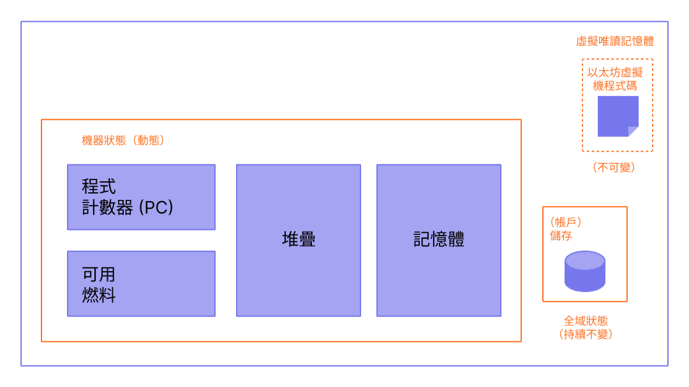

不能用描述雲彩或海浪的相同方式來描述以太坊虛擬機的實體安裝，但它確實作為一個單獨_實體_存在，由數千臺相互連結且運行以太坊用戶端的電腦維護。

以太坊協議本身的存在僅是為了保持這個特殊狀態機持續、不間斷和不可變的運行。 它是所有以太坊帳戶和智慧型合約存在的環境。 對於區塊鏈上的任何一個區塊，以太坊有且僅有一種『規範』狀態，而以太坊虛擬機用於定義在區塊之間計算新的有效狀態的規則。

## 基本資訊 {#prerequisites}

首先，對電腦科學之常用術語，例如[字節位元組](https://wikipedia.org/wiki/Byte)、[記憶體](https://wikipedia.org/wiki/Computer_memory)及[堆疊](https://wikipedia.org/wiki/Stack_(abstract_data_type))等有一個基本認知，才能夠理解以太坊虛擬機。 熟悉密碼學/區塊鏈概念，如[雜湊函式](https://wikipedia.org/wiki/Cryptographic_hash_function)和[梅克爾樹](https://wikipedia.org/wiki/Merkle_tree)等也有幫助。

## 從帳本至狀態機 {#from-ledger-to-state-machine}

我們經常使用「分佈式帳本」這一比喻來描述比特幣一類的區塊鏈，區塊鏈透過使用一些基礎加密工具來支持去中心化貨幣。 帳本維護著活動記錄，並且必須遵守一套管控帳本修改相關操作的規則。 例如，比特幣地址無法花費超出其先前接受數量之比特幣。 此類規則構成比特幣及其他區塊鏈上所有交易的基礎。

盡管以太坊有著自己的原生加密貨幣（以太幣）且遵循幾乎相同的直觀規則，但它還支持一種更加強大的功能：[智慧型合約](/developers/docs/smart-contracts/)。 對於此更為複雜的功能，需要一種更貼切之比喻來形容以太坊。 以太坊並非分佈式帳本，而是一種分佈式[狀態機](https://wikipedia.org/wiki/Finite-state_machine)。 以太坊狀態為一種龐大資料結構，其中不僅包含所有帳戶與餘額還包括_機器狀態_，機器狀態能夠遵照先前定義的一套規則在區塊之間變化並能執行任何機器程式碼。 在區塊之間變更狀態的具體規則由以太坊虛擬機定義。

 _此圖源於[以太坊EVM圖解](https://takenobu-hs.github.io/downloads/ethereum_evm_illustrated.pdf)_

## 以太坊狀態轉換函式 {#the-ethereum-state-transition-function}

以太坊虛擬機的運行類似於數學函式：提供一個輸入，就會生成確定的輸出。 因此，更加正式地描述以太坊具有**狀態轉換函式**將很有幫助：

```
Y(S, T)= S'
```

提供一個舊的有效狀態 `(S)` 及一組新的有效交易 `(T)`，以太坊狀態轉換函式 `Y(S, T)` 將生成一個新的有效輸出狀態 `S'`。

### 狀態 {#state}

在以太坊情境下，狀態為一個龐大的資料結構，稱為[改進的梅克爾帕特里夏樹](/developers/docs/data-structures-and-encoding/patricia-merkle-trie/)，該樹保存由雜湊值連接在一起的所有[帳戶](/developers/docs/accounts/)且可回朔至在區塊鏈上儲存的單一根哈希。

### 交易 {#transactions}

交易為完全由帳戶指令加密簽章. 交易主要有兩種類型：一種交易發起訊息調用，一種啟動合約建立。

合約建立將建立一個新合約帳戶，其中包含已編譯的[智慧型合約](/developers/docs/smart-contracts/anatomy/)位元組碼。 當其他帳戶對該合約進行訊息調用時，將執行該合約的位元組碼。

## 以太坊虛擬機相關說明 {#evm-instructions}

以太坊虛擬機的執行類似於[堆疊機](https://wikipedia.org/wiki/Stack_machine)，執行深度為 1024 個專案。 每個專案均為 256 位元的字，選擇它是為了方便用於 256 位元加密（例如，Keccak-256 雜湊或 secp256k1 簽章）。

執行過程中，以太坊虛擬機維持一個臨時_記憶體_（即字尋址字元陣列），該記憶體於交易間隔期間不存在。

然而，合約確實包含一棵梅克爾帕特里夏_儲存_樹（即字尋址字陳列），該樹與相關帳戶關聯且是全域狀態的一部分。

已編譯的智慧型合約位元組碼作為一些以太坊虛擬機[作業碼](/developers/docs/evm/opcodes)執行，後者執行標準堆疊操作，例如 `XOR`、`AND`、`ADD`、`SUB` 等。 以太坊虛擬機亦可透過一些區塊鏈特定的堆疊操作實作，例如 `ADDRESS`、`BALANCE`、`BLOCKHASH` 等。

 _圖表源於[以太坊虛擬機圖解](https://takenobu-hs.github.io/downloads/ethereum_evm_illustrated.pdf)_

## 以太坊虛擬機實作 {#evm-implementations}

所有以太坊虛擬機實作均須遵照以太坊黃皮書中規定的相關規範。

在以太坊九年的歷程中，以太坊虛擬機經歷了數次修改，有著各種不同程式語言的以太坊虛擬機實作。

[以太坊執行用戶端](/developers/docs/nodes-and-clients/#execution-clients)包含以太坊虛擬機實作。 此外，還有一些獨立的實作，包括：

- [Py-EVM](https://github.com/ethereum/py-evm) - _Python_
- [evmone](https://github.com/ethereum/evmone) - _C++_
- [ethereumjs-vm](https://github.com/ethereumjs/ethereumjs-vm) - _JavaScript_
- [revm](https://github.com/bluealloy/revm) - _Rust_

## 延伸閱讀 {#further-reading}

- [以太坊黃皮書](https://ethereum.github.io/yellowpaper/paper.pdf)
- [Jellopaper 亦稱為 KEVM：K 框架中的以太坊虛擬機語意](https://jellopaper.org/)
- [The Beigepaper](https://github.com/chronaeon/beigepaper)
- [以太坊虛擬機作業碼](https://www.ethervm.io/)
- [以太坊虛擬機作業碼互動式參考資料](https://www.evm.codes/)
- [Solidity 文件簡介](https://docs.soliditylang.org/en/latest/introduction-to-smart-contracts.html#index-6)

## 相關主題 {#related-topics}

- [Gas](/developers/docs/gas/)
