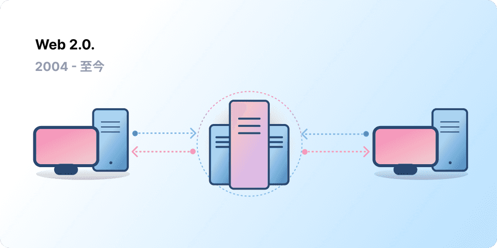
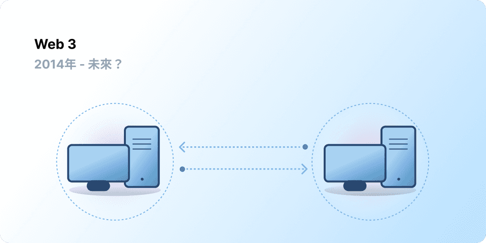

# Web3 簡介 {#introduction}

中心化在過去已幫助數十億人進入全球資訊網，並於其上建立穩定而強大的基礎設施。 於此同時，只有少數中心化實體支配著大部分全球資訊網，能夠單方面決定什麼應該允許，什麼不該允許。

Web3 就是這個困境的出路。 Web3 不是由大型科技公司壟斷的網路，它接納去中心化，並由其使用者建立、操作和擁有。 Web3 將權力交予個人而非公司手中。 討論 Web3 之前，先來看看我們是如何走到這一步。

<Divider />

## 早期的網路 {#early-internet}

大多數人認為網路是現代生活的穩定支柱，發明後便一直存在至今。 然而，大多數人今日所知道的網路，與最初想像的相差甚遠。 將網路的簡單歷史粗略分成 web 1.0 和 web 2.0 時期，有助於更加理解這點。

### Web 1.0：唯讀 (1990-2004) {#web1}

1989 年，日內瓦歐洲核子研究組織 (CERN) 的 Tim Berners-Lee 忙於協定的開發，即後來的全球資訊網 (WWW)。 他的想法是？ 建立開放、去中心化的協定，使人能從全球任何一處分享資訊。

Berners-Lee 的發明大約在 1990 年到 2004 年之間誕生，現今稱為「Web 1.0」。 Web 1.0 原先主要是公司擁有的靜態網站，使用者之間幾乎零互動，個人很少產生內容，導致第一代網際網路被稱為唯讀網路。

### Web 2.0：讀寫（2004 - 至今） {#web2}

隨著社交媒體平台的出現，2004 年開始進入 Web 2.0時期。 網路不再是唯讀，演變成讀寫式。 公司不向使用者提供內容，開始提供平台，以分享使用者產生的內容，並參與使用者間的互動。 隨著上網的人數增加，少數頂級公司開始控管不成比例的網路流量和網路上所產生的價值。 Web 2.0 也催生了廣告驅動的收入模式。 使用者雖能建立內容，但並不擁有內容，或在內容貨幣化之後從中受益。

<Divider />

## Web 3.0：讀-寫-擁有 {#web3}

以太坊推出後不久，[以太坊](/what-is-ethereum/)聯合創辦人 Gavin Wood 在 2014 年創造「Web 3.0」一詞。 許多早期的加密貨幣採用者認為，網路要求的信任度太高，Gavin 以言語表達出此問題的解決之道： 人們今日所知和使用的網路層面，大多仰賴於對少數私營公司的信任，信任他們以公眾的最大利益行事。

### 什麼是Web3 ? {#what-is-web3}

對於展望更美好的新網際網路，Web3 一詞包羅萬象。 Web3 的核心是利用區塊鏈、加密貨幣和非同質化代幣，以所有權的形式將權力交還給使用者。 [推特 2020 年一篇貼文](https://twitter.com/himgajria/status/1266415636789334016)說得最好：Web1 為唯讀，Web2 為讀寫，Web3 為讀-寫-擁有。

#### Web3 的核心思想 {#core-ideas}

要嚴格定義 Web3 是什麼雖然很困難，但 Web3 的建置有一些核心指導原則。

- **Web3 為去中心化**：並不是由集中化的實體控制和擁有大片網際網路，所有權分散在其建構者和使用者之間。
- **Web3 無需許可**：參與 Web3 人人平等，沒有人被排除在外。
- **Web3 有原生支付方式：**其使用加密貨幣在線上消費和匯款，而不是依賴銀行和付款處理器過時的基礎設施。
- **Web3 為去信任化**：使用激勵和經濟機制來運行，而不是依賴受信任的第三方。

### 為什麼 Web3 很重要？ {#why-is-web3-important}

Web3 的殺手級功能並非相互隔絕，也不適合分門別類，但為簡單起見，我們嘗試做出區隔，以便更容易理解。

#### 所有權 {#ownership}

Web3 以前所未有的方式讓你擁有數位資產的所有權。 例如，假設你正在玩 Web2 的遊戲。 如果購買遊戲內的物品，會直接與帳戶綁定。 如果遊戲創作者刪除你的帳戶，這些物品就都沒了。 或者，如果停止玩那個遊戲，對遊戲內物品所投資的價值將會遺失。

Web3 允許透過[非同質化代幣 (NFT) ](/glossary/#nft)實現直接所有權。 沒有人有權剝奪你的所有權，即使是遊戲的創作者亦然。 而且，如果不再玩遊戲，你可以在公開市場上出售或交易遊戲內的物品，並收回其價值。

<InfoBanner shouldSpaceBetween emoji=":eyes:">
  
深入了解非同質化代幣

  <ButtonLink to="/nft/">
    更多非同質化代幣相關資訊
  </ButtonLink>
</InfoBanner>

#### 抗審查性 {#censorship-resistance}

平台和內容創作者之間的權力動態嚴重失衡。

OnlyFans 是一個由使用者產生的成人內容網站，內容創作者超過 100 萬名，其中許多人使用該平台作為他們的主要收入來源。 2021 年 8 月，OnlyFans 宣布了禁止色情內容的計畫。 此公告在平台上的創作者中引發了憤怒，他們認為他們雖幫助建立平台，但收入被剝奪。 經強烈反對後，該決定很快被推翻。 儘管創作者贏得了這場仗，但這突顯了第二代網際網路創作者的一個問題：如果你離開平台，聲譽和後續累積的成果都沒了。

在 Web3 上，你的資料位於區塊鏈上。 當你決定離開某個平台，你的聲譽能隨你而行，投入另一個更清楚符合你價值的介面。

Web 2.0 要求內容製作者相信平台不會更改規則，但抗審查是 Web3 平台的原生特性。

#### 去中心化自治組織(DAOs) {#daos}

除了在 Web3 中擁有個人資料外，你還能利用類似公司股票的代幣，來擁有該平台，將平台作為一個集合體。 去中心化自治組織讓你能協調平台的去中心化所有權，並對其未來做出相關決策。

從技術層面定義，去中心化自治組織是一種事先商定的[智慧型合約](/glossary/#smart-contract)，此合約透過資源池（代幣）自動執行去中心化決策。 擁有代幣的使用者，對資源的使用方式進行投票，而程式碼會自動執行投票結果。

然而，許多 Web3 社群都被定義為去中心化自治組織。 這些社群都透過程式碼實現了不同程度的去中心化和自動化。 目前，我們仍在探索去中心化自治組織是什麼，以及其未來可能如何發展。

<InfoBanner shouldSpaceBetween emoji=":eyes:">
  
了解更多關於去中心化自治組織

  <ButtonLink to="/dao/">
    更多關於DAOs
  </ButtonLink>
</InfoBanner>

### 身份 {#identity}

過去是為每個使用的平台建立一個帳戶。 例如，你可能有一個 Twitter 帳戶、一個 YouTube 帳戶和一個 Reddit 帳戶。 想更改顯示名稱或設定檔圖片？ 你必須在每個帳戶中執行此操作。 在某些情況下，你可以使用社交登入，但這帶來一個熟悉的問題，亦即審查。 只要按一下，這些平台就能完全斷絕你原有的網路生活。 更糟的是，許多平台要求向其交託個人身份資訊，方能建立帳戶。

Web3 透過以太坊地址及[以太坊名稱服務 (ENS) ](/glossary/#ens)個人檔案讓你控制你的數位身份，以解決這些問題。 使用以太坊地址能跨平台提供單一登入，而且安全、抗審查且匿名。

### 原生支付 {#native-payments}

Web2 的付款基礎設施仰賴於銀行和付款處理器，不包含那些沒有銀行帳戶的人，或碰巧住在非正確國家境內的人。 Web3 使用[以太幣](/glossary/#ether)等代幣直接在瀏覽器中匯款，不需要受信任的第三方。

<ButtonLink to="/eth/">
  更多詳情關於以太(以太幣)
</ButtonLink>

## Web3 限制 {#web3-limitations}

儘管目前形式的 Web3 有許多好處，但該生態系統仍然必須解決許多限制，才能蓬勃發展。

### 可存取性 {#accessibility}

已有許多重要的 Web3 功能，可供任何人免費使用，例如以太坊登入功能。 但是，交易的相對成本仍然讓許多人望而卻步。 因交易費高昂，Web3 不太可能在較不富裕的發展中國家使用。 在以太坊上，這些挑戰正在透過[開發藍圖](/roadmap/)和[二層網路擴容方案](/glossary/#layer-2)加以解決。 該技術已經準備就緒，但我們需要在二層網路上達到更高的採用率，使每個人都能存取 Web3。

### 使用者體驗 {#user-experience}

目前使用 Web3 的技術門檻太高了。 使用者必須理解安全疑慮、了解複雜的技術文件，並瀏覽不直觀的使用者介面。 尤其，雖然[錢包提供商](/wallets/find-wallet/)正努力解決這個問題，但在 Web3 整體獲得採用之前，還需要取得更多進展。

### 教育 {#education}

Web3 引入了新的典範，這些典範需學習與 Web2 所用不同的心理模型。 隨著 Web1.0 在 1990 年代後期越來越流行，類似的教育運動於焉而生。網路的擁護者使用一系列教育技術來教育大眾，舉凡簡單的比喻（資訊高速公路、瀏覽器、上網），甚至是[電視廣播](https://www.youtube.com/watch?v=SzQLI7BxfYI)。 Web3 並不難，但與眾不同。 利用教育計畫讓 Web2 的使用者，了解這些Web3 典範，對其成功至關重要。

Ethereum.org 透過其[翻譯計畫](/contributing/translation-program/)為 Web3 教育做出貢獻，致力將重要的以太坊內容翻譯成盡可能越多語言。

### 中心化基礎設施 {#centralized-infrastructure}

Web3 生態系統很年輕且發展迅速。 因此，其目前主要依賴於中心化基礎設施（GitHub、Twitter、Discord 等）。 許多 Web3 公司目前爭相填補這些空缺，但建立優質可靠的基礎架構需要時間。

## 去中心化的未來 {#decentralized-future}

Web3 是一個年輕且不斷發展的生態系統。 Gavin Wood 在 2014 年創造了這個詞，但許多這些想法直到最近才成真。 光是去年，對於加密貨幣、二層網路擴容解決方案的改進，新管理體系形式的大規模實驗以及數位身份的革命，人們的興趣便大幅增加。

使用 Web3 打造更美好的網路才正開始起步，但隨著我們持續改善支援性基礎設施，網路的未來看起來一片光明。

## 我如何參與 {#get-involved}

- [取得錢包](/wallets/)
- [尋找社群](/community/)
- [探索 Web3 應用程式](/dapps/)
- [參與 DAO](/dao/)
- [在 Web3 上構建](/developers/)

## 衍生閱讀 {#further-reading}

Web3 並未嚴格定義。 不同社群參與者對它有不同的看法。 請見：

- [什麼是 Web3？ 明日去中心化網際網路的相關解說](https://www.freecodecamp.org/news/what-is-web3/) – _Nader Dabit_
- [搞懂 Web 3](https://medium.com/l4-media/making-sense-of-web-3-c1a9e74dcae) – _Josh Stark_
- [為什麼 Web 3 很重要](https://future.a16z.com/why-web3-matters/) — _Chris Dixon_
- [為什麼去中心化很重要](https://onezero.medium.com/why-decentralization-matters-5e3f79f7638e) - _Chris Dixon_
- [Web 3 的景況](https://a16z.com/wp-content/uploads/2021/10/The-web3-Readlng-List.pdf) – _a16z_
- [Web 3 的辯論](https://www.notboring.co/p/the-web3-debate?s=r) – _Packy McCormick_

<QuizWidget quizKey="web3" />
