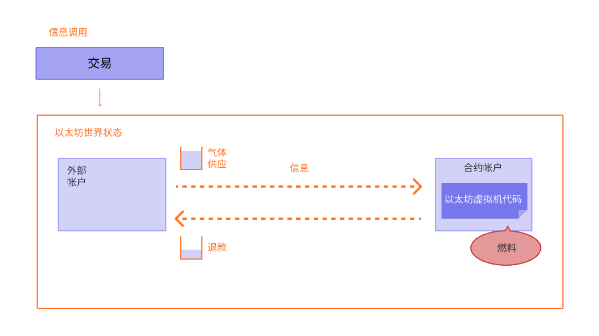

Gas 对以太坊网络至关重要。 正是这种燃料使它能够运行，正如车辆需要汽油一样。

## 前提条件 {#prerequisites}

为了更好地理解此页面，推荐先阅读[交易](/developers/docs/transactions/)和 [EVM](/developers/docs/evm/)。

## 什么是 Gas？ {#what-is-gas}

Gas 是指在以太坊网络上执行特定操作所需的计算工作量。

由于每笔以太坊交易都需要计算资源才能执行，每笔交易都需要付费。 在这个方面上，Gas 是指在以太坊成功进行交易所需的费用。

 _示意图节选自[以太坊虚拟机图解](https://takenobu-hs.github.io/downloads/ethereum_evm_illustrated.pdf)_

本质上，Gas 费用是以太坊的货币以太 (ETH) 支付的。 Gas 价格以 Gwei 标明，Gwei 本身就是 ETH 的一个单位――每个 Gwei 等于 0.000000001 ETH (10-9 ETH)。 例如，您可以说您的 Gas 成本为 1 Gwei，而不是说您的 Gas 成本为 0.000000001 以太。 “gwei”一词本身表示“giga-wei”，等于 1,000,000,000 wei。 Wei 本身（以 [b-money](https://www.investopedia.com/terms/b/bmoney.asp) 的发明者 [Wei Dai](https://wikipedia.org/wiki/Wei_Dai) 命名）是 ETH 中最小的单位。

## 伦敦升级之前 {#pre-london}

以太坊网络交易费的计算方式在 2021 年 8 月的[伦敦升级](/history/#london)后发生了改变。 以下回顾了过去的工作方式：

假设 Alice 需要支付 1 ETH 给 Bob。 在交易中，燃料限额为 21,000 单位，燃料的价格是 200 gwei。

总费用为:`燃料单位（限额） * 燃料单价` 例如 `21,000 * 200 = 4,200,000 gwei` 或者 0.0042 ETH

## 伦敦升级之后 {#post-london}

假设 Jordan 需要向 Taylor 支付 1 个以太币。 在交易中，燃料限额为 21,000 单位，基础费是 10 gwei。 Jordan 支付了 2 gwei 作为小费。

现在，总费用为：`units of gas used * (base fee + priority fee)`，其中 `base fee` 是协议设置的值，`priority fee` 是用户设置的值，即给验证者的小费。

即，`21,000 * (10 + 2) = 252,000 gwei` 或 0.000252 个以太币。

当 Jordan 转账时，将从 Jordan 帐户中扣除 1.000252 个以太币。 Taylor 的帐户增加 1.0000 个以太币。 验证者收到 0.000042 个以太币的小费。 0.00021 个以太币的基础费被销毁。

此外，Jordan 还可以为交易设定最高费用 (`maxFeePerGas`)。 最高费用与实际费用之间的差额将退还 Jordan。即 `refund = max fee - (base fee + priority fee)`。 Jordan 可以为要执行的交易设置一个最高支付金额，而不用担心在执行交易时“超额”支付基础费。

### 区块大小 {#block-size}

在伦敦升级之前，以太坊具有固定大小的区块。 在网络需求高峰期，这些区块满负荷运行。 因此，用户常常不得不等到需求量从高峰降低后才能将交易添加到区块中，这导致用户体验很糟糕。

伦敦升级为以太坊引入了大小可变的区块。 每个区块的目标大小为 1500 万单位燃料，但区块的大小将根据网络需求增减，但不得超过 3000 万单位燃料的区块大小限制（目标区块大小的 2 倍）。 协议通过 _tâtonnement_ 过程使均衡区块大小平均达到 1,500 万单位燃料。 这意味着如果区块大小超出目标区块大小，协议将增加下一个区块的基础费。 同样，如果区块大小小于目标区块大小，协议将减少基础费。 基础费的调整金额与当前区块大小和目标区块大小的差距成比例。 [更多关于区块的信息](/developers/docs/blocks/)。

### 基础费 {#base-fee}

每个区块都有一个基础费作为底价。 要想有资格添加到区块中，燃料费用报价必须至少等于基础费。 基础费独立于当前区块计算，是由当前区块之前的区块决定的，这使得用户更容易预测交易费。 当区块被开采时，其基础费将被“销毁”并退出流通。

基础费是用一个公式计算的，该公式将前一个区块的大小（所有交易中使用的燃料数量）与目标大小进行比较。 如果超过目标区块大小，每个区块的基础费将最多增加 12.5%。 这种指数级增长使得区块大小无限期保持高位在经济上不可行。

| 区块编号 | 已包含燃料 | 费用增加 | 当前基本费用 |
| -------- | ---------: | -------: | -----------: |
| 1        |        15M |       0% |     100 gwei |
| 2        |        30M |       0% |     100 gwei |
| 3        |        30M |    12.5% |   112.5 gwei |
| 4        |        30M |    12.5% |   126.6 gwei |
| 5        |        30M |    12.5% |   142.4 gwei |
| 6        |        30M |    12.5% |   160.2 gwei |
| 7        |        30M |    12.5% |   180.2 gwei |
| 8        |        30M |    12.5% |   202.7 gwei |

相对于伦敦升级之前的燃料拍卖市场，这种交易费机制的变化使费用更容易预测。 根据以上表格，要在 9 号区块创建交易，钱包会让用户明确知晓，要将交易添加到下一个区块的**最大基础费**等于 `current base fee * 112.5%` 或 `202.8 gwei * 112.5% = 228.1 gwei`。

还请注意，由于在处理完整区块时基础费增加的速度，我们不太可能看到长时间出现完整区块高峰。

| 区块编号 | 已包含燃料 | 费用增加 |    当前基本费用 |
| -------- | ---------: | -------: | --------------: |
| 30       |        30M |    12.5% |     2705.6 gwei |
| ...      |        ... |    12.5% |             ... |
| 50       |        30M |    12.5% |    28531.3 gwei |
| ...      |        ... |    12.5% |             ... |
| 100      |        30M |    12.5% | 10302608.6 gwei |

### 优先费（小费） {#priority-fee}

在伦敦升级之前，矿工获得区块中所含全部交易的总燃料费。

由于新的基础费被销毁，伦敦升级引入了优先费（小费），激励矿工将交易添加到区块中。 如果没有小费，矿工会发现开采空区块在经济上可行，因为他们会获得相同的区块奖励。 在正常情况下，一笔金额不大的小费为矿工添加交易提供了极小的激励。 对于需要在同一区块中优先执行的交易，需要提供更高的小费，力争使出价高于竞争交易。

### 最高费用 {#maxfee}

要在网络上执行交易，用户可以为他们愿意支付的交易执行费用指定最高限额。 此可选参数称为 `maxFeePerGas`。 为了执行交易，最高费用必须超过基础费和小费的总和。 交易完成后，会退还给交易发送人最高费用与基础费和小费总和之间的差额。

### 计算费用 {#calculating-fees}

伦敦升级带来的主要好处之一是提升了用户在设定交易费时的体验。 对于支持该升级的钱包，用户无需明确说明愿意支付多少费用来完成交易，钱包提供商将自动设置推荐的交易费（基础费 + 建议优先费），以便降低用户面临的复杂程度。

## EIP-1559 {#eip-1559}

在伦敦升级中实现的 [EIP-1559](https://eips.ethereum.org/EIPS/eip-1559) 使得交易费机制比以前的燃料价格竞拍更加复杂，但优点是提高了燃料费用的可预测性，使交易费市场更加高效。 用户可以在提交交易时设定 `maxFeePerGas`（对应于他们愿意为执行交易支付多少费用），他们清楚支付金额将不会超过燃料的市场价格 (`baseFeePerGas`)，并且多支付的金额将在减去小费后退还。

下面的视频解释了 EIP-1559 及其带来的好处：

<YouTube id="MGemhK9t44Q" />

如果感兴趣，你可以阅读 [EIP-1559 规范](https://eips.ethereum.org/EIPS/eip-1559)。

如欲进一步深入，请参考 [EIP-1559 资源](https://hackmd.io/@timbeiko/1559-resources)。

## 为什么存在燃料费用？ {#why-do-gas-fees-exist}

简而言之，燃料费用有助于确保以太坊网络的安全。 在网络上执行的每次计算都需要收费，这样可以防止不良行为者给网络带来垃圾信息。 为了防止代码中出现无意或恶意的无限循环或其他计算浪费，要求每个交易对可以采用的代码执行计算步骤设置一个限制。 基本计算单位是“燃料”。

尽管交易中包含费用限制，但交易中未使用的所有燃料将退还给用户（即退还 `max fee - (base fee + tip)`）。

 _示意图节选自[以太坊虚拟机图解](https://takenobu-hs.github.io/downloads/ethereum_evm_illustrated.pdf)_

## 什么是燃料限额？ {#what-is-gas-limit}

燃料限额是指你愿意在交易中消耗的最大燃料数量。 涉及[智能合约](/developers/docs/smart-contracts/)的更复杂交易需要进行更多的计算工作，因此相比简单的支付，它们需要更高的燃料限额。 标准以太币转账要求燃料限额为 21,000 单位燃料。

例如，如果你对简单的以太币转账设置 50,000 单位燃料限额，以太坊虚拟机将消耗 21,000 单位，你将收到剩余的 29,000 单位。 然而，如果你设置的燃料太少，比如说，对于简单的以太币转账，设置燃料限额为 20,000 单位，以太坊虚拟机将消耗 20,000 单位燃料并尝试完成交易，但不会完成。 然后，以太坊虚拟机回滚所有变化，但由于矿工已经完成了价值 20k 单位燃料的工作，这些燃料就被消耗了。

## 为什么燃料费会变得如此高？ {#why-can-gas-fees-get-so-high}

燃料费高是由于以太坊广受欢迎。 在以太坊进行任何操作都需要消耗燃料，并且每个区块的燃料空间有限。 费用括计算费用、存储或操作数据费用或转移代币费用，这些操作消耗不同数量的“燃料”单位。 随着去中心化应用程序的功能变得更加复杂，智能合约执行的操作数量也会增加，即每笔交易在有限大小的区块内占用更多空间。 如果需求量太大，用户必须提供更高的小费，力争使出价高于其他用户的交易。 小费越高，交易进入下一个区块的可能性就越大。

光靠燃料价格并不能实际决定我们必须为特定交易支付的金额。 为了计算交易费，我们必须将使用的燃料乘以基础燃料费，后者以 Gwei 为单位。

## 减少燃料成本的举措 {#initiatives-to-reduce-gas-costs}

以太坊[可扩展性升级](/roadmap/)应该最终解决部分燃料费用问题，并让以太坊平台能够每秒处理数千个交易，从而全面扩容。

二层网络扩容是一项主要举措，可大大优化燃料成本、用户体验和可扩展性。 [更多关于二层网络扩容的信息](/developers/docs/scaling/#layer-2-scaling)。

## 降低燃料成本的策略 {#strategies-for-you-to-reduce-gas-costs}

如果你希望降低以太币的燃料成本，可以设置小费来表明交易的优先级。 矿工将“处理”并执行每单位燃料小费更高的交易，因为他们可以保留你支付的小费；矿工不太愿意执行小费较低的交易。

如果想要监控燃料价格，用较少的费用发送以太币，你可以使用多种不同的工具，例如：

- [Etherscan](https://etherscan.io/gastracker) _交易 gas 价格估算器_
- [Blocknative ETH Gas Estimator](https://chrome.google.com/webstore/detail/blocknative-eth-gas-estim/ablbagjepecncofimgjmdpnhnfjiecfm) _支持类型 0 传统交易和类型 2 EIP-1559 交易的 gas 估算 Chrome 插件。_

- [ETH Gas Station](https://ethgasstation.info/) _以太坊 gas 市场面向消费者的指标_
- [Cryptoneur 燃料费计算器](https://www.cryptoneur.xyz/gas-fees-calculator) _按照您当地货币计算主网、Arbitrum 和 Polygon 上进行的各类交易的燃料费。_

## 相关工具 {#related-tools}

- [Blocknative 的燃料平台](https://www.blocknative.com/gas) _由 Blocknative 的全局内存池数据平台提供支持的燃料估算应用程序接口_

## 延伸阅读 {#further-reading}

- [以太坊 Gas 详解](https://defiprime.com/gas)
- [减少智能合约的 gas 消耗](https://medium.com/coinmonks/8-ways-of-reducing-the-gas-consumption-of-your-smart-contracts-9a506b339c0a)
- [权益证明与工作量证明](https://blockgeeks.com/guides/proof-of-work-vs-proof-of-stake/)

## 相关主题 {#related-topics}

- [挖矿](/developers/docs/consensus-mechanisms/pow/mining/)
