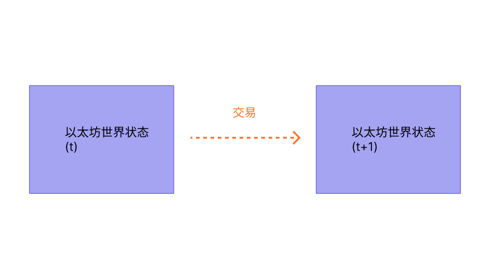

交易是由帐户发出，带密码学签名的指令。 帐户将发起交易以更新以太坊网络的状态。 最简单的交易是将 ETH 从一个账户转到另一个帐户。

## 前置要求 {#prerequisites}

为了帮助您更好地理解这个页面，我们建议您先阅读[账户](/developers/docs/accounts/)和我们的[以太坊简介](/developers/docs/intro-to-ethereum/)。

## 什么是交易？ {#whats-a-transaction}

以太坊交易是指由外部持有账户发起的行动，换句话说，是指由人管理而不是智能合约管理的账户。 例如，如果 Bob 向 Alice 发送 1 ETH，则 Bob 的帐户必须减少 1 ETH，而 Alice 的账户必须增加 1 ETH。 交易会造成状态的改变。

 _图表来自 [Ethereum EVM 插图](https://takenobu-hs.github.io/downloads/ethereum_evm_illustrated.pdf)_

改变 EVM 状态的交易需要广播到整个网络。 任何节点都可以在 EVM 上广播交易请求；此后，矿工将执行交易并将由此产生的状态变化传播到网络的其他部分。

交易需要收费并且必须开采才能有效。 为了使这种概述更加简单，我们将其称为 Gas 费和挖矿。

所提交的交易包括下列信息：

- `recipient` – 接收地址（如果为一个外部持有的帐户，交易将传输值。 如果为合约帐户，交易将执行合约代码）
- `signature` – 发送者的标识符。 当通过发送者的私钥签名交易来确保发送者已授权此交易时，生成此签名。
- `value` – 从发件人向收件人转移 ETH 的金额 （以 WEI 为单位，ETH 的一种面值单位）
- `data` – 可包括任意数据的可选字段
- `gasLimit` – 交易可以消耗的 Gas 的最大数量。 Gas 单位代表了计算步骤
- `maxPriorityFeePerGas` - 作为矿工小费包含的最大 gas 数量
- `maxFeePerGas` - 愿意为交易支付的最大 gas 数量（包括 `baseFeePerGas` 和 `maxPriorityFeePerGas`）

Gas 是指矿工处理交易所需的算力。 用户必须为此计算支付费用。 `gasLimit` 和 `gasPrice` 决定支付给矿工的最高交易费用。 [关于 Gas 的更多信息](/developers/docs/gas/)。

交易对象看起来像这样：

```js
{
  from: "0xEA674fdDe714fd979de3EdF0F56AA9716B898ec8",
  to: "0xac03bb73b6a9e108530aff4df5077c2b3d481e5a",
  gasLimit: "21000",
  maxFeePerGas: "300"
  maxPriorityFeePerGas: "10"
  nonce: "0",
  value: "10000000000",
}
```

但交易对象需要使用发送者的私钥签名。 这证明交易只可能来自发送者，而不是欺诈。

Geth 这样的以太坊客户端将处理此签名过程。

示例 [JSON-RPC](https://eth.wiki/json-rpc/API) 调用：

```json
{
  "id": 2,
  "jsonrpc": "2.0",
  "method": "account_signTransaction",
  "params": [
    {
      "from": "0x1923f626bb8dc025849e00f99c25fe2b2f7fb0db",
      "gas": "0x55555",
      "maxFeePerGas": "0x1234",
      "maxPriorityFeePerGas": "0x1234",
      "input": "0xabcd",
      "nonce": "0x0",
      "to": "0x07a565b7ed7d7a678680a4c162885bedbb695fe0",
      "value": "0x1234"
    }
  ]
}
```

示例响应：

```json
{
  "jsonrpc": "2.0",
  "id": 2,
  "result": {
    "raw": "0xf88380018203339407a565b7ed7d7a678680a4c162885bedbb695fe080a44401a6e4000000000000000000000000000000000000000000000000000000000000001226a0223a7c9bcf5531c99be5ea7082183816eb20cfe0bbc322e97cc5c7f71ab8b20ea02aadee6b34b45bb15bc42d9c09de4a6754e7000908da72d48cc7704971491663",
    "tx": {
      "nonce": "0x0",
      "maxFeePerGas": "0x1234",
      "maxPriorityFeePerGas": "0x1234",
      "gas": "0x55555",
      "to": "0x07a565b7ed7d7a678680a4c162885bedbb695fe0",
      "value": "0x1234",
      "input": "0xabcd",
      "v": "0x26",
      "r": "0x223a7c9bcf5531c99be5ea7082183816eb20cfe0bbc322e97cc5c7f71ab8b20e",
      "s": "0x2aadee6b34b45bb15bc42d9c09de4a6754e7000908da72d48cc7704971491663",
      "hash": "0xeba2df809e7a612a0a0d444ccfa5c839624bdc00dd29e3340d46df3870f8a30e"
    }
  }
}
```

- `raw` 是已签名交易的 RLP（Recursive Length Prefix）编码形式。
- `tx` 是已签名交易的 JSON 形式。

如有签名哈希，可通过加密技术证明交易来自发送者并提交网络。

### `data`字段 {#the-data-field}

绝大多数交易从外部所有的帐户访问合约。 大多数合约用 Solidity 语言编写，并根据[应用程序二进制接口 (ABI)](/glossary/#abi) 解释其`data`字段。

前四个字节使用函数名称和参数的哈希指定要调用的函数。 有时可以使用[本数据库](https://www.4byte.directory/signatures/)根据选择器识别函数。

调用数据的其余部分是参数，[按照应用程序二进制接口规范中的规定进行编码](https://docs.soliditylang.org/en/latest/abi-spec.html#formal-specification-of-the-encoding)。

例如，我们来看一下[这笔交易](https://etherscan.io/tx/0xd0dcbe007569fcfa1902dae0ab8b4e078efe42e231786312289b1eee5590f6a1)。 使用 **Click to see More（单击查看更多）**查看调用数据。

函数选择器是 `0xa9059cbb`。 有几个[具有此签名的已知函数](https://www.4byte.directory/signatures/?bytes4_signature=0xa9059cbb)。 本例中[合约源代码](https://etherscan.io/address/0xa0b86991c6218b36c1d19d4a2e9eb0ce3606eb48#code)已经上传到 Etherscan，所以我们知道该函数是 `transfer(address, uint256)`。

其余数据如下：

```
0000000000000000000000004f6742badb049791cd9a37ea913f2bac38d01279
000000000000000000000000000000000000000000000000000000003b0559f4
```

根据应用程序二进制接口规范，整型值（例如地址，它是 20 字节整型）在应用程序二进制接口中显示为 32 字节的字，前面用零填充。 所以我们知道 `to` 地址是 [`4f6742badb049791cd9a37ea913f2bac38d01279`](https://etherscan.io/address/0x4f6742badb049791cd9a37ea913f2bac38d01279)。 `value` 是 0x3b0559f4 = 990206452。

## 交易类型 {#types-of-transactions}

以太坊有几种不同类型的交易：

- 常规交易：从一个帐户到另一个帐户的交易。
- 合约部署交易：没有“to”地址的交易，数据字段用于合约代码。
- 执行合约：与已部署的智能合约进行交互的交易。 在这种情况下，“to”地址是智能合约地址。

### 关于燃料 {#on-gas}

如上所述，执行交易需要耗费[燃料](/developers/docs/gas/)。 简单的转账交易需要 21000 单位燃料。

因此，如果 Bob 要在 `baseFeePerGas` 为 190 Gwei 且 `maxPriorityFeePerGas` 为 10 Gwei 时给 Alice 发送一个以太币，Bob 需要支付以下费用：

```
(190 + 10) * 21000 = 4,200,000 gwei
--或--
0.0042 ETH
```

Bob 的帐户将会减少 **-1.0042 ETH**

Alice 的帐户将会增加 **+1.0 ETH**

基础费将会燃烧 **-0.00399 ETH**

矿工获得 **+0.000210 ETH** 的小费

任何智能合约交互也需要燃料。

 _示意图节选自[以太坊虚拟机图解](https://takenobu-hs.github.io/downloads/ethereum_evm_illustrated.pdf)_

任何未用于交易的燃料都会退还给用户帐户。

## 交易生命周期 {#transaction-lifecycle}

交易提交后，就会发生以下情况：

1. 一旦您发送交易，加密法生成交易哈希： `0x97d99bc7729211111a21b12c933c949d4f31684f1d6954ff477d0477538ff017`
2. 然后将该交易转播到网络，并且与大量其他交易一起包含在一个集合中。
3. 矿工必须选择您的交易并将它包含在一个区块中，以便验证交易并认为它“成功”。
   - 如果网络繁忙，矿工无法跟上，您可能会在这个阶段等候。
4. 您的交易将收到"确认"。 确认的数量是自包含您交易的区块以来创建的区块数。 这个数字越大，交易被网络处理和承认的确定性就越强。
   - 最近的区块可能会被重组，给人留下交易失败的印象；但交易可能仍然有效，但包含在另一个区块中。
   - 重组的概率随着其后每一次挖掘的区块而降低，即确认次数越多，交易就越不可改变。

## 直观演示 {#a-visual-demo}

跟随 Austin 了解交易、燃料和挖矿。

<YouTube id="er-0ihqFQB0" />

## Typed Transaction Envelope 交易 {#typed-transaction-envelope}

以太坊最初有一种交易形式。 每笔交易都包含 Nonce、燃料价格、燃料限制、目的地地址、价值、数据、v、r 和 s。 这些字段采用 RLP 编码，如下所示：

`RLP([nonce, gasPrice, gasLimit, to, value, data, v, r, s])`

以太坊经过演变，已经支持多种类型的交易，从而能够在不影响传统交易形式的情况下实现访问列表和 [EIP-1559](https://github.com/ethereum/EIPs/blob/master/EIPS/eip-1559.md) 等新功能。

[EIP-2718：类型化交易封套](https://eips.ethereum.org/EIPS/eip-2718)定义了交易类型，是未来交易类型的”封套“。

EIP-2718 是用于类型化交易的新通用封套。 在新标准中，交易被解释为：

`TransactionType || TransactionPayload`

其中，字段定义如下：

- `TransactionType` - 一个在 0 到 0x7f 之间的数字，总共为 128 种可能的交易类型。
- `TransactionPayload` - 由交易类型定义的任意字节数组。

## 延伸阅读 {#further-reading}

- [EIP-2718：Typed Transaction Envelope](https://eips.ethereum.org/EIPS/eip-2718)

_还有哪些社区资源对您有所帮助？ 请编辑本页面并添加它！_

## 相关主题 {#related-topics}

- [帐户](/developers/docs/accounts/)
- [以太坊虚拟机 (EVM)](/developers/docs/evm/)
- [燃料](/developers/docs/gas/)
- [矿工](/developers/docs/consensus-mechanisms/pow/mining/)
